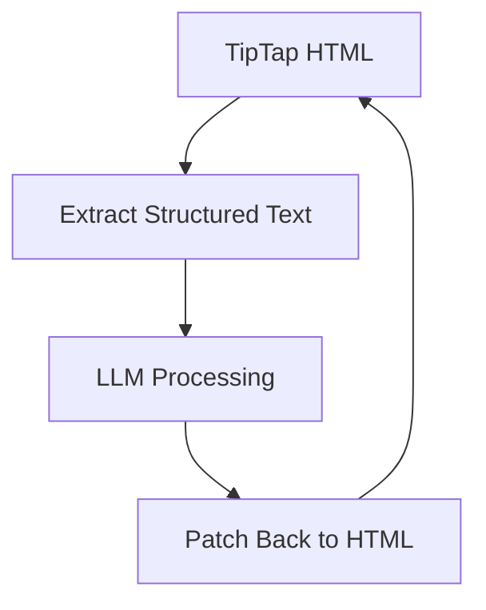

# 🛠 Fix: Rich Text Editor (Highlight + Table) Issues — Full Solution Guide

## 🎯 Objective

Resolve issues where:

* Text **highlight disappears**
* **Tables break / lose structure**
* Editor content becomes inconsistent after LLM operations

This guide ensures:

* ✅ LLM uses plain text safely
* ✅ HTML formatting is preserved (tables, highlights, layout)
* ✅ Editor remains stable (no rerender bugs)
* ✅ Supports future scalable editing (selection-based AI editing)

---

# 🧠 Root Cause Summary

| Problem              | Cause                                |
| -------------------- | ------------------------------------ |
| Highlight disappears | Streamlit rerender + state overwrite |
| Table breaks         | HTML stripped to plain text          |
| Formatting lost      | LLM operates on raw text             |
| Cursor jump          | uncontrolled TipTap state sync       |
| Structure destroyed  | treating HTML as string              |

---

# 🏗 Target Architecture (Correct Design)



---

# ✅ FIX 1: Replace `html_to_plain_text` with Structured Conversion

## ❌ Problem

Current function destroys tables:

```python
soup.get_text()
```

---

## ✅ Solution: Convert HTML → Structured Text (Markdown Table)

### 🔧 Code

```python
from bs4 import BeautifulSoup

def html_to_structured_text(html: str) -> str:
    if not html:
        return ""

    soup = BeautifulSoup(html, "html.parser")
    output = []

    # ── Convert tables to Markdown ──
    for table in soup.find_all("table"):
        rows = []
        for tr in table.find_all("tr"):
            cols = [
                td.get_text(separator=" ", strip=True) or "-"
                for td in tr.find_all(["td", "th"])
            ]
            rows.append(cols)

        if rows:
            header = rows[0]
            output.append("| " + " | ".join(header) + " |")
            output.append("|" + "|".join(["---"] * len(header)) + "|")

            for row in rows[1:]:
                output.append("| " + " | ".join(row) + " |")

        table.decompose()

    # ── Extract remaining text ──
    text = soup.get_text("\n")

    return "\n".join(output) + "\n\n" + text.strip()
```

---

## 🎯 Purpose

* Preserve table structure for LLM
* Prevent data merging
* Maintain readability

---

# ✅ FIX 2: Separate Editor HTML vs LLM Input

## 🔧 Code

```python
editor_html = work_content  # TipTap HTML
llm_input = html_to_structured_text(work_content)
```

---

## 🎯 Purpose

* UI uses HTML
* LLM uses structured plain text
* Prevents formatting loss

---

# ✅ FIX 3: Remove `<tr>` Injection Bug

## ❌ Current Bug

```python
for tag in soup.find_all([... "tr", ...]):
    tag.insert_before("\n")
```

---

## ✅ Fix

```python
for tag in soup.find_all([
    "p", "div", "br", "li",
    "h1", "h2", "h3",
    "h4", "h5", "h6",
    "blockquote"
]):
    tag.insert_before("\n")
```

---

## 🎯 Purpose

* Prevent table row corruption
* Maintain correct layout

---

# ✅ FIX 4: Fix TipTap State Sync (CRITICAL)

## ❌ Problem

```python
if work_content != st.session_state.work_content_val:
```

---

## ✅ Fix

```python
st.session_state.work_content_val = work_content
```

---

## 🎯 Purpose

* Prevent unnecessary rerenders
* Fix highlight disappearing
* Stabilize editor behavior

---

# ✅ FIX 5: HTML Sanitization Before Re-render

## 🔧 Code

```python
from bs4 import BeautifulSoup

def clean_html(html: str) -> str:
    soup = BeautifulSoup(html, "html.parser")
    return str(soup)
```

### Apply:

```python
new_content = clean_html(new_content)
```

---

## 🎯 Purpose

* Fix broken HTML from LLM
* Prevent invalid DOM rendering

---

# ✅ FIX 6: Selection-Based Editing (IMPORTANT)

## 💡 Concept

Only edit selected content, not entire document

---

## 🔧 Code (Pseudo Implementation)

```python
selected_html = get_selected_html()

plain = html_to_structured_text(selected_html)

edited = generate_selection_edit(plain)

new_html = f"<p>{edited}</p>"

replace_selected_content(selected_html, new_html)
```

---

## 🎯 Purpose

* Prevent full document corruption
* Keep tables & formatting intact
* Enable precise AI editing

---

# ✅ FIX 7: Safe HTML Wrapping for LLM Output

## 🔧 Code

```python
def wrap_text_to_html(text: str) -> str:
    paragraphs = text.split("\n\n")
    return "".join(f"<p>{p}</p>" for p in paragraphs if p.strip())
```

---

## 🎯 Purpose

* Convert LLM output → valid HTML
* Prevent raw text injection issues

---

# ✅ FIX 8: Add Table Context Tags (Optional but Recommended)

## 🔧 Code

```python
output.append("[TABLE]")
...
output.append("[/TABLE]")
```

---

## 🎯 Purpose

* Improve LLM understanding
* Prevent hallucinated structure

---

# 🚀 Advanced (Production-Level)

## 🔴 DOM-Aware Patch System

### Structure Example

```json
[
  {"id": 1, "type": "paragraph", "text": "..."},
  {"id": 2, "type": "table", "rows": [...]}
]
```

---

### LLM Output

```json
[
  {"id": 1, "text": "Updated content"}
]
```

---

### Apply Patch

```python
def apply_patch(soup, patches):
    for p in patches:
        node = soup.find(attrs={"data-id": str(p["id"])})
        if node:
            node.string = p["text"]
```

---

## 🎯 Purpose

* Full formatting preservation
* Safe updates
* Scalable architecture

---

# ⚠️ Critical Rules

### ❌ NEVER

* Send raw HTML to LLM
* Replace entire HTML blindly
* Strip tables to plain text

---

### ✅ ALWAYS

* Convert → structured text
* Edit only necessary parts
* Patch back to HTML
* Sanitize before render

---

# 🎯 Final Result

After applying all fixes:

| Feature       | Status       |
| ------------- | ------------ |
| Highlight     | ✅ Stable     |
| Table editing | ✅ Preserved  |
| LLM editing   | ✅ Safe       |
| Formatting    | ✅ Maintained |
| Editor UX     | ✅ Smooth     |

---

# 💡 Key Insight

> HTML ≠ Text
> HTML = Structured Document (DOM Tree)

Your system must:

* Treat it as structure
* Not as string


**End of Guide**
